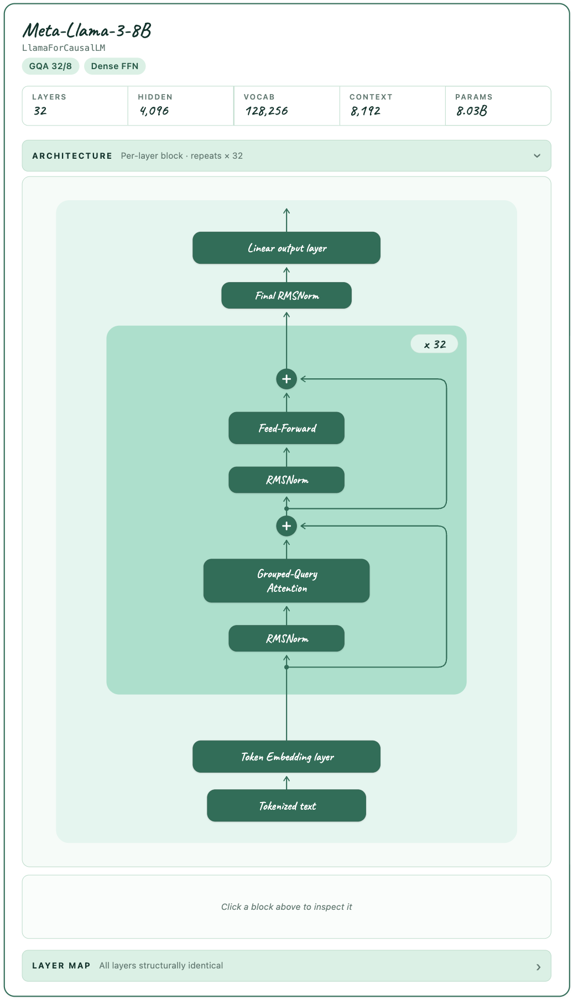

# MODEL UNFOLDER

> your one click model unfolder

```python
from model_unfolder import unfold
unfold("meta-llama/Meta-Llama-3-8B")
```

<p align="center">
  <a href="examples/llama-3-8b.html">
    
  </a>
</p>

---

## Install

```bash
pip install model-unfolder

# for local development
pip install -e .
pip install transformers   # only required to load by model ID
```

## Three ways to call it

```python
from model_unfolder import unfold

# 1) by HuggingFace model ID — only config.json is downloaded, never weights
unfold("meta-llama/Meta-Llama-3-8B")
unfold("deepseek-ai/DeepSeek-V3")

# 2) from a transformers AutoConfig
from transformers import AutoConfig
unfold(AutoConfig.from_pretrained("Qwen/Qwen2.5-7B", trust_remote_code=True))

# 3) from a raw config.json dict — no transformers install needed
import json
unfold(json.load(open("config.json")))
```

## Built on `transformers`

Pass a model ID and `unfold` calls `transformers.AutoConfig.from_pretrained(model_id)` under the hood ([parser.py](model_unfolder/parser.py)). It only retries with `trust_remote_code=True` when Transformers says the config requires remote code.

## Auth-token from your environment

Gated models (Llama-3, Mistral, Gemma, …) need a HuggingFace token. `unfold` reuses whatever `transformers` / `huggingface_hub` already see:

```bash
# Either set an env var
export HF_TOKEN="hf_xxxxxxxx"            # also accepted: HUGGING_FACE_HUB_TOKEN

# or use the CLI cache (persists across sessions)
huggingface-cli login

# or load a .env in your notebook
# >>> from dotenv import load_dotenv; load_dotenv()
```

No extra config in `model_unfolder` itself.

## Save / export

```python
diagram = unfold(cfg)
diagram.save("model.html")   # standalone interactive HTML
diagram.save("model.json")   # IR (no rendering)
diagram.param_count()        # {"total": ..., "active": ..., "per_layer": [...]}
diagram.to_ir()              # full IR dict
```

Param estimates are close to published numbers — DeepSeek-V3 reports `~675B (~41B active)`, Llama-3-8B reports `8.03B`.

## Live demos

Open in any browser to interact (click blocks, expand sub-blocks, toggle layer types):

| Model | Highlights | Demo |
|---|---|---|
| Llama-3-8B | GQA + dense baseline | [examples/llama-3-8b.html](examples/llama-3-8b.html) |
| Mistral-7B-v0.3 | GQA + dense, 32k context | [examples/mistral-7b-v0.3.html](examples/mistral-7b-v0.3.html) |
| DeepSeek-V3 | MLA + dense → MoE phase change | [examples/deepseek-v3.html](examples/deepseek-v3.html) |
| Kimi K2 | MLA + 384-expert MoE, ~1T params | [examples/kimi-k2.html](examples/kimi-k2.html) |

## Supported architectures

| Family | Adapter | Notes |
|---|---|---|
| DeepSeek-V2 / V3 / Kimi K2 | [families/deepseek.py](model_unfolder/adapters/transformer/families/deepseek.py) | MLA + dense → MoE phase change |
| Llama / Mistral / Qwen2 / Qwen3 / Phi-3 | [families/llama.py](model_unfolder/adapters/transformer/families/llama.py) | GQA / MQA / MHA + dense FFN |
| Gemma 4 | [families/gemma4.py](model_unfolder/adapters/transformer/families/gemma4.py) | sliding/global layers, KV sharing, PLE |


## License

[Apache 2.0](LICENSE).
