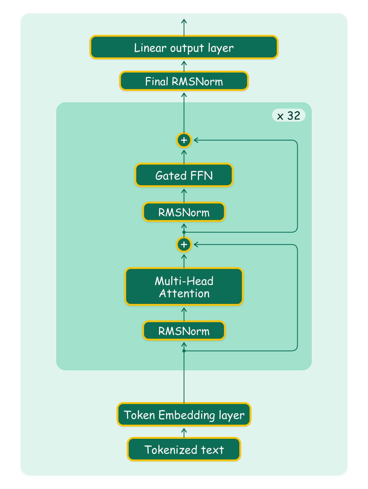

# Model Unfolder

Turn a Hugging Face model ID or config into an interactive architecture
explanation. Version **0.3.0** is an honesty and reliability release: it shows
what the resolved model code and checkpoint config prove, and visibly labels
what remains unresolved instead of filling gaps with a familiar architecture.

```python
from model_unfolder import unfold

diagram = unfold("meta-llama/Meta-Llama-3-8B")
diagram                         # renders inline in Jupyter
diagram.save("model.html")     # standalone interactive HTML
diagram.save("model.json")     # expanded architecture JSON
```

<p align="center">
  <a href="examples/llama-7b.html">
    
  </a>
</p>

## Install

```bash
pip install model-unfolder==0.3.0
```

The package includes the tested source-reading dependencies. Model weights are
not downloaded. Gated/private repositories still require a Hugging Face token:

```bash
export HF_TOKEN="hf_..."
```

The library also accepts an already-loaded config or a raw `config.json` dict:

```python
from transformers import AutoConfig
from model_unfolder import unfold

unfold(AutoConfig.from_pretrained("Qwen/Qwen3-8B"))
unfold({"architectures": ["LlamaForCausalLM"], "hidden_size": 4096, ...})
```

Repository-provided remote Python is not executed in this release. A repository
that cannot be understood without `trust_remote_code=True` receives a typed,
actionable refusal rather than an interactive prompt or a guessed diagram.

## Evidence contract

Model Unfolder separates three questions:

1. **Structure:** every shown component or relation must have an owner.
2. **Mechanism:** it comes from the model's resolved code; unknown mechanisms
   remain visibly unresolved.
3. **Values:** numbers come from an exact config path, constructor expression,
   or parameter shape.

The flow is one-way: resolved sources and config values produce typed facts;
facts produce the canonical IR; renderers only present it. A class name, model
ID, config flag, renderer convention, or missing trace cannot silently select
architecture.

## Published coverage

[`coverage.json`](coverage.json) is the machine-readable denominator for this
release. Across its 29 reviewed corpus witnesses and 15 frozen unseen-model
checks, the exact S4 receipt is:

| Proven | Visibly flagged | Silent |
|---:|---:|---:|
| **621** | **241** | **0** |

`flagged` is not a hidden success: the drawing tells the reader which evidence
is unresolved. `silent = 0` means no known blocking audit result or crash is
hidden from the product. These counts measure the frozen inputs in
`coverage.json`; they are not a promise that every Hugging Face model is fully
understood.

### Reviewed support set (29)

This is exactly the `cohort: "corpus"` set in `coverage.json`:

| | | |
|---|---|---|
| AuraFlow-v0.3 | bloom | CogVideoX-5b |
| dbrx-base | DeepSeek-V3 | FLUX.2-dev |
| FluxTransformer2DModel | gemma-2-2b-it | GLM-4.5 |
| gpt-oss-20b | granite-3.0-8b-instruct | HunyuanVideo |
| llama-7b | LTX-Video | Lumina-Image-2.0 |
| mochi-1-preview | musicgen-small | OLMo-2-1124-7B |
| PixArt-Sigma-XL-2-1024-MS | prxpixel-t2i | Qwen-Image |
| Qwen2-VL-7B-Instruct | Qwen3.5-27B text component | Qwen3-8B |
| Sana_1600M_1024px_diffusers | stable-diffusion-3.5-large | stable-diffusion-xl-base-1.0 |
| stablelm-2-1_6b | Wan2.2-T2V-A14B-Diffusers | |

The 15 `cohort: "unseen"` entries are a standing generalization/robustness
gate, not additions to the reviewed support set.

## Known incomplete structure

- Stable Diffusion 3.5 and PixArt currently show the denoiser shell and an
  explicit “repeated denoiser structure unresolved” warning; they do not invent
  a conventional transformer stack.
- SDXL exposes eleven exact denoiser config reads that are not yet proven into
  the drawing. The exact rows are available under the warning disclosure.
- The unseen Jamba control visibly reports that its current attention drawing
  does not yet match every Mamba/attention layer; the warning is not a fix.
- Some Qwen3.x multimodal configs preserve the proven text tower while showing
  `projector evidence unresolved`; no projector mechanism is manufactured.
- Parameter totals remain estimates until the later instance/parameter-shape
  authority is connected. Any counting convention used for an unknown is shown.

These are planned evidence gaps, not family-specific exceptions. Future work
replaces each warning only when a general source/instance proof exists.

## Export and diagnostics

```python
diagram.to_ir()          # canonical typed architecture, as a dict
diagram.to_json()        # expanded consumer schema
diagram.param_count()    # total / active / per-layer estimate
diagram.warnings         # human summaries of every visible unresolved class
```

The warning bar presents one readable summary per check. Opening a summary
reveals the exact audit rows, so friendly wording never erases the evidence
receipt.

## License

[Apache 2.0](LICENSE)
